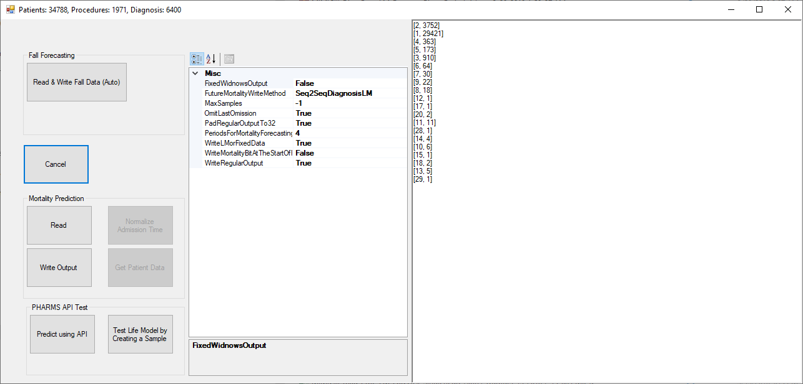

# Life Model
This folder contains all the code used for LifeModel forecasting in Predictive Analytics in Health Monitoring thesis by Alireza Manashty (2019).
To read the MIMIC III data and convert it to the Life Model version, please download and use the MIMICIII Reader project (written in C#). The latest and most accurate implementation of Life Model is in that project.
There is also an old implementation of LM in Python that I placed in here (LifeModel.py)

Here's an screenshot of the MIMIC III Convertor:

